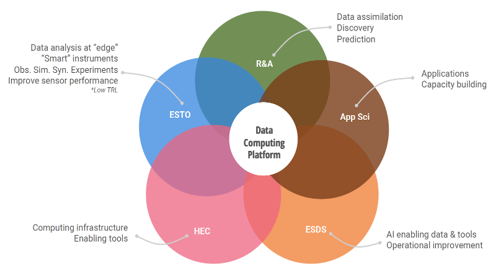
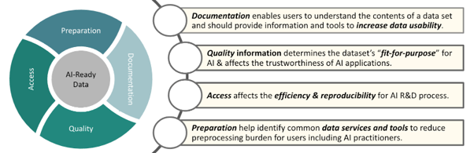

[Previous](standards.md) | [Table of contents](README.md) | [Next](usage-methods-of-ml-and-ai-for-eo.md)

***
# 6. Initiatives and Programs

**TODO
I have to write some introduction about several initiatives and programs for AI and ML.
It might be a shortcut in some cases/students. Because those activities have all information such as data, use cases, platforms and tools.
**

## 6.1. NASA (ESDIS, IMPACT)
NASA's Earth Science Division programs are investing in specific areas of AI/ML with specific strategies at the Earth Science Division level to avoid duplication of effort.  

We outline five NASA organizations and their five major goals for AI/ML below,

Figure X. NASA Earth Science Division AI focus areas

NASA’s High-End Computing (HEC) program has made investments in AI-specific platforms. These platforms include HPC and cloud assets with the latest hardware accelerators and AI specific processors and libraries. 

The R&A program supports more targeted AI activities, some of which have been realized  through competitive solicitations. Currently, most of their focus has been around modeling and assimilation. EOSDIS houses 20 Petabytes of earth science data in the cloud and is working on ways to make that data easily available to ML practitioners in an Analysis-Ready, Cloud-optimized (ARCO) manner. Improving cloud-based earth science data’s interoperability with ML managed services from major cloud providers is also a high priority for EOSDIS.

These goals address the entire data lifecycle process, including collaborations and building AI capacity and expertise within the program. The data systems program has a number of activities related to AI aligning with NASA’s strategic goals – that includes;
competitive program and partnership activities
augmenting data stewardship tasks such as search and discovery
maximizing the use of data. 

ESDS also fosters AI/ML research through NASA's Advancing Collaborative Connections for Earth System Science (ACCESS) program. This competitive program develops and implements technologies to effectively manage, discover, and utilize NASA's archive of Earth observations for scientific research and applications in support of NASA Earth science research goals. The following are the most recent ACCESS projects utilizing AI:
Advancing an Open-Access Repository for Earth Observation Training Data and Machine Learning Models

|Name|Landcovernet|
|--|--|
|**Problem Statement**| - Provide a multi-mission global land cover training dataset   - Develop an Open API for registering and retrieving ML models |
| **Project Scope** | Global spatial coverage   Cloud-optimized Geotiff |
| **Data Governance and Compliance**  | |
| **Version Control** | - https://mlhub.earth/data/ref_landcovernet_af_v1   Current version 1.0 |
| **Input data provenance** | - Sentinel-1 ground range distance (GRD) with radiometric calibration and orthorectification at 10m spatial resolution   - Sentinel-2 surface reflectance product (L2A) at 10m spatial resolution   Landsat-8 surface reflectance product from Collection 2 Level-2   
| **Required infrastructure** | |
| **Dependencies** || 
| **Key performance metrics** ||
| **Security and Privacy** ||
| **Documentation** | https://mlhub.earth/docs |

- [Developing Passive Satellite Cloud Remote Sensing Algorithms Using Collocated Observations, Numerical Simulation and Deep Learning](https://www.earthdata.nasa.gov/esds/competitive-programs/access/ml-cloud-properties)
- [GeoWeaver: Building An Open-Source Platform for Enabling Ad Hoc Management, Open Sharing, and Robust Reuse of NASA Earth Data-Driven Hybrid AI Workflows](https://www.earthdata.nasa.gov/esds/competitive-programs/access/geoweaver)
- [Machine Learning Datasets for the Earth's Natural Microwave Emission](https://www.earthdata.nasa.gov/esds/competitive-programs/access/microwave-emission)
- [Machine Learning Planet High Resolution Training Data for Medium Resolution Land Cover and Disturbance Mapping](https://www.earthdata.nasa.gov/esds/competitive-programs/access/ml-planet-data)
- [Pangeo ML: Open Source Tools and Pipelines for Scalable Machine Learning Using NASA Earth Observation Data](https://www.earthdata.nasa.gov/esds/competitive-programs/access/pangeo-ml)
- [Spatio-Temporal Machine Learning and Cloud Computing for Predicting Dynamics of Global Vegetation Structure from Active Satellite Sensors](https://www.earthdata.nasa.gov/esds/competitive-programs/access/ml-vegetation-structure)
- [Training Data for Streamflow Estimation](https://www.earthdata.nasa.gov/esds/competitive-programs/access/streamflow-estimation)

## 6.2. NOAA/NCAI (Rob Redmon,Douglas Rao)
NOAA has a long history using AI, including machine learning (ML) to support its mission areas, such as deep-sea exploration, habitat characterization, fishery species assessments, environmental modeling, and interpretation of Earth observations. In 2021, NOAA released its first AI Strategy with five goals:

1. Establish an efficient organizational structure and processes to advance AI across NOAA.
1. Advance AI research and innovation in support of NOAA’s mission.
1. Accelerate the transition of AI research to applications. 
1. Strengthen and expand AI partnerships. 
1. Promote AI proficiency in the workforce.   

To achieve these goals, NOAA created a five-year strategic plan with a more coordinated approach across NOAA to embrace AI in support of NOAA’s mission areas through effectively developing the AI-ready data and tools for reliable and efficient processing, interpretation, and utilization of Earth observations.

Working with scientific fields and offices, NOAA has established the NOAA Center for Artificial Intelligence ([NCAI](https://www.noaa.gov/ai)) to support new and ongoing projects and to propel innovative uses of responsible AI technology to support environmental equity, knowledge, and study.

Since its inception, NCAI has been focused on developing a focal point for NOAA to facilitate the advancement of AI-ready data and workforce development. NCAI is leading the development of community-driven data standards for AI-ready open environmental data through the collaboration with Earth Science Information Partners. The collaboration produced the first AI-readiness checklist for open environmental data (https://github.com/esipfed/data-readiness) that are currently being used or plan to be used by NOAA, UK Met Office, World Data Systems, and other geoscience data repositories to conduct assessments of the readiness of environmental data including earth observations for AI development. 

Figure X. Four groups of characteristics of AI-ready data defined by the Earth Science Information Partners (https://github.com/esipfed/data-readiness).

At its current stage, the AI-readiness assessment requires data experts to go through the published checklist manually which is difficult to be scaled to more than 60 PBs of environmental datasets at NOAA. Thus, NOAA is investing in a prototype tool using a natural language processing method to automate the AI-readiness assessment process and recommend improvements to existing NOAA datasets for AI development.

Additionally, NOAA has invested in the improvement of selected datasets for AI applications, such as, [Tropical Cyclone PRecipitation, Infrared, Microwave, and Environmental Dataset (TC PRIMED)](https://rammb-data.cira.colostate.edu/tcprimed/), NOAA Climate Data Records, and [water column sonar data.](https://www.ncei.noaa.gov/products/water-column-sonar-data) 

## 6.3 Indian Space Research Organization (ISRO)

The Indian Space Research Organisation (ISRO) has increasingly incorporated Artificial Intelligence (AI) in various facets of Earth observation data processing, marking a transformative shift in data processing technology. AI is playing a pivotal role in automating and enhancing the efficiency of data analysis, enabling ISRO to glean valuable insights from the vast amounts of information gathered by Earth observation satellites. 
ISRO’s work in the field of AI can be categorized in three broad domains - Data acquisition related processing, data processing/fusion/augmentation and information extraction. Some key representative tasks in each category, that are being addressed through the use of AI, are shown in Figure X. Machine learning algorithms, particularly deep learning models, are being utilized to surpass the classical approaches in each of these domains to improve the overall impact of the Earth observation data collected and processed at ISRO.
Figure X. Broad categorisation of AI/ML related projects at ISRO.

In the data acquisition related AI processing, the emphasis is on improving the quality of the data which is obtained from various spaceborne/airborne sensors.  Various models developed in this area include data reconstruction, image restoration, thermal resolution improvement as well as models related to compression/decompression of the high-resolution data. 

The second category is for the data processing and augmentation research projects that are focusing on using data from multiple-sources (multimodal, multi-temporal or multi-sensor) to generate enhanced value products through the use of AI. This includes tasks such as spatial or spectral super-resolution, data fusion, image-to-image translation and generation of various types of AI-ready data for downstream tasks. 

The final category of AI related tasks is the information extraction category. The primary objective here is to derive information such as resource maps, land-use land cover classification, specific object detection, content aware image search, as well as onboard intelligence applications. Some of the methods are targeting the time-series and change detection applications. Many models have been built in this category, e.g. cloud-detection, forest-fire detection, solar rooftop potential estimation, building footprint extraction, etc. 

The work related to this aspect is integrated via research and development related to core topics in AI such as development of new models for specific applications, adaptation of cutting edge research for specific use cases, implementation of infrastructure for supporting development and deployment of AI applications, and core AI research such as explainable AI. Work is also being done to integrate and harness the potential of vast amounts of data available from ISRO’s fleet of remote sensing sensors. 

ISRO is also working towards a common framework, where the work related to AI that is taking place across different teams and projects can be synergized. In this direction, some standards have been studied and are planned to be implemented in near future. Some of these models are now being integrated into publicly available web-platforms.
