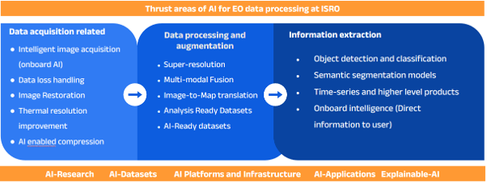

[Previous](standards.md) | [Table of contents](README.md) | [Next](usage-methods-of-ml-and-ai-for-eo.md)

***
# 4. Initiatives and Programs

**TODO
I have to write some introduction about several initiatives and programs for AI and ML.
It might be a shortcut in some cases/students. Because those activities have all information such as data, use cases, platforms and tools.
**
## 4.1. CEOS/SEO (EO-GPT & CEOS-GPT)

The CEOS Systems Engineering Office provides leadership and support to CEOS through management and technical services and by developing tools and methods for societal benefit. The CEOS SEO also provides innovation and thought leadership in the area of AI/ML applied to the use of Earth Observation (EO) data. The CEOS SEO is working on two early-stage research projects which serve as frameworks for experimenting with modern LLM/AI research and tooling: 1. EO-GPT and 2. CEOS-GPT.

1. EO-GPT is a Natural language processing (NLP) interface for processing EO data and answering Earth Observation questions. EO-GPT provides a chat interface for the Earth sciences and remote sensing applications domain. It is an LLM augmented interactive analysis framework. Earth observation analysis is modular by nature. The goal of EOGPT is to create a framework that orchestrates custom analysis flexibly using large language models as the orchestration mechanism. EO-GPT features:
    * A module-based system whereby earth-observation algorithms run as microservices. Modules have natural language outputs (to aid in live execution/parameterization).
    * A large language model orchestrates the execution of these modules.
    * An LLM parameterizes the use of modules based on initial conditions/queries, but also utilizes information given from modules for live parameterization of processing steps.
    * Offers a chat visualization of geospatial assets and content.

2. CEOS-GPT is an interface to all the information available on the CEOS website (http://www.ceos.org/). CEOS GPT provides a question and answering chatbot that operates on the large volume of CEOS data,  with the vision of addressing a wide range of topics including training and meeting information, organizational questions, policy questions, and data availability. CEOS-GPT features:
    * CEOS website and private documents are indexed in a retrieval augmented generative (RAG) system.
    * Mixture of agents architecture with each agent responsible for retrieving some type of information from an index.
    * Private models exist for generating document embeddings and a GPT system exists for synthesizing text.
    * Can ask questions about CEOS through an interactive chat-interface.
    * Improvements are regularly benchmarked and evaluated. Improvements are either heuristic improvements to RAG, or improvements of the core large language models (i.e., fine-tuning embedders or the GPT language model).

Our team explores two approaches for constructing generative systems: (a) AI heuristic-driven, and (b) machine learning-driven. Both approaches improve the quality of the generative system and take a substantial amount of research and experimentation. In the heuristic-driven approach, LLMs are treated as abstracted black boxes. Heuristic structures index and organize the data leveraging the LLMs as tools to aid in search index building, information retrieval and response synthesis.  Systems that utilize heuristics would use algorithmic structures built on a large language model. These systems do not aim to modify or optimize an underlying machine learning models, they just utilize them as building blocks for a larger system. The machine learning approach on the other hand, focuses on innovations in the underlying architectures of the models themselves rather than the generative system that's built on them.  The machine learning approach would also encompass setting up the feedback mechanism whereby a model can be fine-tuned to user queries.

The CEOS SEO is planning to mature these early-stage research applications and ultimately release them as tools for the CEOS community.

## 4.2. NASA (ESDIS, IMPACT)
NASA's Earth Science Division programs are investing in specific areas of AI/ML with specific strategies at the Earth Science Division level to avoid duplication of effort.  

We outline five NASA organizations and their five major goals for AI/ML below,

Figure X. NASA Earth Science Division AI focus areas

NASA’s High-End Computing (HEC) program has made investments in AI-specific platforms. These platforms include HPC and cloud assets with the latest hardware accelerators and AI specific processors and libraries. 

The R&A program supports more targeted AI activities, some of which have been realized  through competitive solicitations. Currently, most of their focus has been around modeling and assimilation. EOSDIS houses 20 Petabytes of earth science data in the cloud and is working on ways to make that data easily available to ML practitioners in an Analysis-Ready, Cloud-optimized (ARCO) manner. Improving cloud-based earth science data’s interoperability with ML managed services from major cloud providers is also a high priority for EOSDIS.

These goals address the entire data lifecycle process, including collaborations and building AI capacity and expertise within the program. The data systems program has a number of activities related to AI aligning with NASA’s strategic goals – that includes;
competitive program and partnership activities
augmenting data stewardship tasks such as search and discovery
maximizing the use of data. 

ESDS also fosters AI/ML research through NASA's Advancing Collaborative Connections for Earth System Science (ACCESS) program. This competitive program develops and implements technologies to effectively manage, discover, and utilize NASA's archive of Earth observations for scientific research and applications in support of NASA Earth science research goals. The following are the most recent ACCESS projects utilizing AI:
Advancing an Open-Access Repository for Earth Observation Training Data and Machine Learning Models

|Name|Landcovernet|
|--|--|
|**Problem Statement**| - Provide a multi-mission global land cover training dataset   - Develop an Open API for registering and retrieving ML models |
| **Project Scope** | Global spatial coverage   Cloud-optimized Geotiff |
| **Data Governance and Compliance**  | |
| **Version Control** | - https://mlhub.earth/data/ref_landcovernet_af_v1   Current version 1.0 |
| **Input data provenance** | - Sentinel-1 ground range distance (GRD) with radiometric calibration and orthorectification at 10m spatial resolution   - Sentinel-2 surface reflectance product (L2A) at 10m spatial resolution   Landsat-8 surface reflectance product from Collection 2 Level-2   
| **Required infrastructure** | |
| **Dependencies** || 
| **Key performance metrics** ||
| **Security and Privacy** ||
| **Documentation** | https://mlhub.earth/docs |

- [Developing Passive Satellite Cloud Remote Sensing Algorithms Using Collocated Observations, Numerical Simulation and Deep Learning](https://www.earthdata.nasa.gov/esds/competitive-programs/access/ml-cloud-properties)
- [GeoWeaver: Building An Open-Source Platform for Enabling Ad Hoc Management, Open Sharing, and Robust Reuse of NASA Earth Data-Driven Hybrid AI Workflows](https://www.earthdata.nasa.gov/esds/competitive-programs/access/geoweaver)
- [Machine Learning Datasets for the Earth's Natural Microwave Emission](https://www.earthdata.nasa.gov/esds/competitive-programs/access/microwave-emission)
- [Machine Learning Planet High Resolution Training Data for Medium Resolution Land Cover and Disturbance Mapping](https://www.earthdata.nasa.gov/esds/competitive-programs/access/ml-planet-data)
- [Pangeo ML: Open Source Tools and Pipelines for Scalable Machine Learning Using NASA Earth Observation Data](https://www.earthdata.nasa.gov/esds/competitive-programs/access/pangeo-ml)
- [Spatio-Temporal Machine Learning and Cloud Computing for Predicting Dynamics of Global Vegetation Structure from Active Satellite Sensors](https://www.earthdata.nasa.gov/esds/competitive-programs/access/ml-vegetation-structure)
- [Training Data for Streamflow Estimation](https://www.earthdata.nasa.gov/esds/competitive-programs/access/streamflow-estimation)

## 4.3. NOAA/NCAI (Rob Redmon,Douglas Rao)
NOAA has a long history using AI, including machine learning (ML) to support its mission areas, such as deep-sea exploration, habitat characterization, fishery species assessments, environmental modeling, and interpretation of Earth observations. In 2021, NOAA released its first AI Strategy with five goals:

1. Establish an efficient organizational structure and processes to advance AI across NOAA.
1. Advance AI research and innovation in support of NOAA’s mission.
1. Accelerate the transition of AI research to applications. 
1. Strengthen and expand AI partnerships. 
1. Promote AI proficiency in the workforce.   

To achieve these goals, NOAA created a five-year strategic plan with a more coordinated approach across NOAA to embrace AI in support of NOAA’s mission areas through effectively developing the AI-ready data and tools for reliable and efficient processing, interpretation, and utilization of Earth observations.

Working with scientific fields and offices, NOAA has established the NOAA Center for Artificial Intelligence ([NCAI](https://www.noaa.gov/ai)) to support new and ongoing projects and to propel innovative uses of responsible AI technology to support environmental equity, knowledge, and study.

Since its inception, NCAI has been focused on developing a focal point for NOAA to facilitate the advancement of AI-ready data and workforce development. NCAI is leading the development of community-driven data standards for AI-ready open environmental data through the collaboration with Earth Science Information Partners. The collaboration produced the first AI-readiness checklist for open environmental data (https://github.com/esipfed/data-readiness) that are currently being used or plan to be used by NOAA, UK Met Office, World Data Systems, and other geoscience data repositories to conduct assessments of the readiness of environmental data including earth observations for AI development. 

Figure X. Four groups of characteristics of AI-ready data defined by the Earth Science Information Partners (https://github.com/esipfed/data-readiness).

At its current stage, the AI-readiness assessment requires data experts to go through the published checklist manually which is difficult to be scaled to more than 60 PBs of environmental datasets at NOAA. Thus, NOAA is investing in a prototype tool using a natural language processing method to automate the AI-readiness assessment process and recommend improvements to existing NOAA datasets for AI development.

Additionally, NOAA has invested in the improvement of selected datasets for AI applications, such as, [Tropical Cyclone PRecipitation, Infrared, Microwave, and Environmental Dataset (TC PRIMED)](https://rammb-data.cira.colostate.edu/tcprimed/), NOAA Climate Data Records, and [water column sonar data.](https://www.ncei.noaa.gov/products/water-column-sonar-data) 

## 4.4. Indian Space Research Organization (ISRO)

The Indian Space Research Organisation (ISRO) has increasingly incorporated Artificial Intelligence (AI) in various facets of Earth observation data processing, marking a transformative shift in data processing technology. AI is playing a pivotal role in automating and enhancing the efficiency of data analysis, enabling ISRO to glean valuable insights from the vast amounts of information gathered by Earth observation satellites. 
ISRO’s work in the field of AI can be categorized in three broad domains - Data acquisition related processing, data processing/fusion/augmentation and information extraction. Some key representative tasks in each category, that are being addressed through the use of AI, are shown in Figure X. Machine learning algorithms, particularly deep learning models, are being utilized to surpass the classical approaches in each of these domains to improve the overall impact of the Earth observation data collected and processed at ISRO.
Figure X. Broad categorisation of AI/ML related projects at ISRO.

In the data acquisition related AI processing, the emphasis is on improving the quality of the data which is obtained from various spaceborne/airborne sensors.  Various models developed in this area include data reconstruction, image restoration, thermal resolution improvement as well as models related to compression/decompression of the high-resolution data. 

The second category is for the data processing and augmentation research projects that are focusing on using data from multiple-sources (multimodal, multi-temporal or multi-sensor) to generate enhanced value products through the use of AI. This includes tasks such as spatial or spectral super-resolution, data fusion, image-to-image translation and generation of various types of AI-ready data for downstream tasks. 

The final category of AI related tasks is the information extraction category. The primary objective here is to derive information such as resource maps, land-use land cover classification, specific object detection, content aware image search, as well as onboard intelligence applications. Some of the methods are targeting the time-series and change detection applications. Many models have been built in this category, e.g. cloud-detection, forest-fire detection, solar rooftop potential estimation, building footprint extraction, etc. 

The work related to this aspect is integrated via research and development related to core topics in AI such as development of new models for specific applications, adaptation of cutting edge research for specific use cases, implementation of infrastructure for supporting development and deployment of AI applications, and core AI research such as explainable AI. Work is also being done to integrate and harness the potential of vast amounts of data available from ISRO’s fleet of remote sensing sensors. 

ISRO is also working towards a common framework, where the work related to AI that is taking place across different teams and projects can be synergized. In this direction, some standards have been studied and are planned to be implemented in near future. Some of these models are now being integrated into publicly available web-platforms.

## 4.5. European Space Agency Φ-lab

  

The ESA Φ-lab is the ESA Earth Observation innovation laboratory that aims to accelerate the future of Earth Observation (EO) via transformative innovation and commercialisation actions strengthening Europe’s world-leading competitiveness. 
Artificial Intelligence (AI) is one of the main focus areas for the ESA Φ-lab, since it offers unprecedented capabilities to extract actionable insights from vast amounts of EO data acting as an enabler for novel applications and business models. The ESA Φ-lab covers the whole spectrum of AI development, from ideation to generating concrete impacts in science, technology, or commercial field through its two offices: the **Explore Office** and the **Invest Office**. ESA Φ-lab also supports at different levels of engagement the development of about 20 satellites, some technology demonstrators, other are operational or commercial, of which the great majorities are AI-powered as shown in the image below.

  

The [Explore Office](https://philab.esa.int/explore/) conducts R&D activities on AI for EO by using a `user-driven` approach in exploring the technology from ideation to proof of concept. The office explore technologies and transformative ideas, prove their benefits, builds capacities from validated ideas and finally prepare the impact and uptake by end user. The office also spend a significant effort in growing a large community around  Φ-lab. In doing this, the Explore Office mainly works on 3 technological pillars:

1.	Innovative computing paradigms
2.	Trustable Augmented Intelligence
3.	ICT revolution

Such R&D activities focus on key AI-related technologies and explore their potential for various EO use cases. In particular, the main topics of interest involve:
* `Innovative computing paradigms`: the Φ-lab Explore Office combine AI-related research to the investigation of alternative computing paradigms that could further enhance benefits introduced by AI for specific use cases. Alternative computing paradigms involve:
  * **Edge Computing**: when moved on board EO satellites, AI could enable the detection of actionable information that could significantly reduce the latency for EO use cases having near-real-time requirements (e.g., civil security applications, operational services for natural disasters management). In addition, it could enable novel acquisition systems. \[[1](https://www.esa.int/Enabling_Support/Preparing_for_the_Future/Discovery_and_Preparation/ESA_extends_AI_and_cloud_computing_to_space),[2](https://philab.esa.int/world-breakthrough-in-onboard-ai-model-training-presented-by-%CF%86-lab-at-igarss/)\]. Onboard AI is a central element in the scope of [Φ-Sat-1](https://www.esa.int/Applications/Observing_the_Earth/Ph-sat), [Φsat-2](https://www.esa.int/Applications/Observing_the_Earth/Phsat-2/Introducing_Phsat-2) missions, to which the Φ-lab Explore Office has provided a pivotal contribution.
  * **Neuromorphic computing**: neuromorphic computing is a brain-inspired asynchronous, event-based, and massively parallel computing paradigm. Among various neuromorphic computing techniques, spiking neural networks have attracted the interest of researchers for their potential energy efficiency, which makes it promising for onboard satellite implementations.
  * **Quantum Machine Learning**: when combined to quantum computing algorithms, ML could further enhance its capability to process intricated data structures and very large volume of data. The Φ-lab Explore Office is investigating the potential of quantum and hybrid implementations of ML algorithms for EO use cases\[[1](https://philab.esa.int/flagship-programmes/qc4eo/)\]   
* `Trustable Augmented Intelligence`: this topic investigates numerous AI branches to augment the capabilities to extract actionable and trusthworthy insights from EO data and take informed decisions. The main AI branches under investigation include: 
  * **Explainable AI**: the goal of explainable AI is to provide transparent and/or interpreatable models for various EO use cases.
  * **Physics-informed Machine Learning**: physics-informed ML incorporate physics principle into the training process with potential advantages in terms of data efficiency, computational intensity, and robustness to noisy data. 
  * **Foundation models**: Given the scarcity of labeled EO data, foundation models—large-scale models trained on extensive datasets—have the potential to surpass specialized application models while requiring significantly fewer labeled examples. A key contribution from the Φ-lab Explore Office is the creation of the [PhilEO Bench](https://arxiv.org/abs/2401.04464), a benchmark designed for rigourous evaluation of foundation  models for EO applications. Research on foundation models is often coupled with the investigation of `self-supervised learning`, which aims to train Machine Learning (ML) models in an unsupervised manner. 
  * **Generative AI**: generative AI has various applications in Earth Observation, including spatial resolution of EO data and automatic generation of synthetic images to augment datasets.
  * **Digital assistant for EO**: Large Language Models could be used to create an assistant to facilitate the processing and the interaction with EO data by using natural language\[[1](https://activities.esa.int/4000133903)\].  
    

`User-driven` approach: plethora of R&D activities in AI for EO characterized by an application-centric methodology, which scrutinizes AI's potential for specific, socially impactful use cases, for example:
   * **AI for health**: by using ensemble of ML models to process satellite data, it is possible to predict [dengue fever outbreaks](https://philab.esa.int/%CF%86-lab-and-unicef-joint-dengue-fever-research-receives-further-award/). 
   * **AI for Earth Science**: AI is providing a significant contribution to numerous fields of Earth Science. The Φ-lab Explore Office has investigated the potential of AI for wheather modelling, solar forecasting, and other related applications.  
   * **AI for Green and sustainable future**: in the face of escalating climate changes, the urgency for efficient forecasting and response systems for natural disasters has never been greater. AI can play a critical role in processing and fusing in-situ with satellite data for high spatial and temporal resolution forecasting of [global storm surges](https://philab.esa.int/global-storm-surge-forecasting-creating-early-warning-models-with-ai4eo/).
   * **AI for Destination Earth**: [Destination Earth](https://philab.esa.int/flagship-programmes/destination-earth/) (DestinE) is a European Commission initiative to develop an ambitious AI-driven decision-support system based on a very high accurate digital model of the Earth. This system aims to monitor and simulate natural and human activity, along with developing and validating policy scenarios. ESA participates in the initiative by leading the overall effort in collaboration with EUMETSAT and ECMWF.  ESA Member States have initiated a companion programme, the ESA Digital Twin Earth (DTE), to foster the exploitation of DestinE data for Earth observation and innovation.
   Φ-lab actively supports the activities of DestinE and ESA DTE to bring the demonstrated analysis and reasoning capabilities of AI technologies to the heart of the operations, along with stimulating further exploitation by various user communities.  DestinE will use unprecedented observation and simulation products, powered by Europe’s HPC computers and AI power, to push the limits of computing, forecasting, planning, and acting. 

In pursuit of these goals, Φ-lab Explore Office extensively on activities aiming at community engagement, dissemination and partnership creation with academic and industrial partners, international organizations, and other ESA divisions. To foster research and use of AI for EO use cases, the Φ-lab Explore Office has contributed to the release of:
numerous `datasets` (e.g., [WorldStrat](https://worldstrat.github.io/), [Seeing Beyond the Visible](https://platform.ai4eo.eu/seeing-beyond-the-visible/data), [Major TOM](https://philab.esa.int/hello-major-tom-esa-%CF%86-lab-releases-largest-ml-ready-sentinel-2-dataset-ever-published/), [THRawS](https://zenodo.org/records/7908728), [VSD2Raw](https://zenodo.org/records/7982468), and [DENETHOR](https://openreview.net/pdf?id=uUa4jNMLjrL)) and `toolboxes` (please consult [ESA-PhiLab GitHub](https://github.com/ESA-PhiLab)). 

The [Invest Office](https://philab.esa.int/invest/) promotes commercial initiatives through the [InCubed](https://incubed.esa.int/) (Investing in Industrial Innovation) program. InCubed is a Public Private Partnership co-funding program run by the ESA Φ-lab Invest Office, focusing on developing innovative and commercially viable products and services that exploit the value of EO imagery and datasets. The program's broad scope supports everything from building satellites to developing new EO business models. Today, the majority of proposals for downstream activities are AI-related and focus on agriculture, forestry, emergency response, insurance, maritime, carbon monitoring, and asset management and identification. Instead, for upstream activities, it is trendy to bring AI-processing capabilities at-the-edge to address the data downlink bottleneck and reduce data latency for value maximisation.
The InCubed programme size is about 225m€ and has 140 activities in pipeline with about 10 satellites constellations under development.

## 4.6 UKSA Initiative in AI and ML for Earth Observation

The UKSA recognizes the importance of collaboration and synergy among various organizations and initiatives within the UK's Earth Observation ecosystem. In this regard, the UKSA has established strong partnerships with the UK National Center for Earth Observation (NCEO) and the NERC Earth Observation Data Analysis and AI Service (NEODAAS)
Artificial Intelligence (AI) is at the heart of the UK Government’s plan to kickstart an era of economic growth, transform how to deliver public services and boost living standards for working people across the country. They will be ensuring that AI is used to drive the government’s missions and priorities including across healthcare, the economy and society. They are committed to building an AI sector that can scale and win globally, through the AI Opportunities Action Plan. It will outline an approach to delivering the opportunities AI can bring across the system, setting out UK governmentambition. AI will also form a part of the UK government's in development Industrial Strategy, which will set out to drive the UK’s direction of travel in important industries.

NCEO is a world-leading center of excellence in Earth Observation (EO) science and technology, bringing together a network of leading universities and research institutions. The UKSA actively engages with the NCEO to leverage its expertise and capabilities in areas such as satellite data processing, scientific algorithm development, and the application of advanced analytical techniques, including AI and ML.
Through joint research projects and technology development initiatives, the UKSA and the NCEO work together to address critical challenges in Earth Observation. This collaboration aims to accelerate the translation of scientific advancements into practical applications and operational services that can benefit society, the economy, and the environment.
The UKSA work with NCEO and NEODAAS to develop the UK’s AI and Earth Observation Capacities. NEODAAS hosts the Massive GPU Cluster for Earth Observation (MAGEO) and provides EO Data, AI support and development to UK based researchers working on a range of EO focused domains. This has resulted in numerous successful projects applying advanced ML techniques to EO data.

### Key Contributions of UKSA and NCEO

- Data Processing and Analysis: One of the primary focuses of the UKSA initiative is to improve the processing of EO data. By leveraging AI and ML, NCEO has developed advanced algorithms that can analyze large datasets more quickly and accurately than traditional methods. This is particularly important for time-sensitive applications, such as monitoring natural disasters or tracking climate change impacts.
- Harmonization and Fusion of Data: The integration of AI and ML has also facilitated the harmonization and fusion of different types of EO data. This means that data from various sources, such as multispectral and hyperspectral sensors, can be combined to provide a more comprehensive view of the Earth's surface. The NCEO has been instrumental in demonstrating how AI can enhance the understanding of land use and land cover (LULC) changes, which is crucial for effective environmental management.
- Development of Analysis Ready Data (ARD): The initiative has focused on creating Analysis Ready Data (ARD) products that are pre-processed and ready for analysis. For instance, the Sentinel-2 satellite data undergoes atmospheric correction using the Sen2Cor algorithm, which is a proprietary method that ensures the data is suitable for further analysis. This preprocessing step is vital for ensuring the accuracy of AI and ML applications in Earth observation.
- Applications in Agriculture: AI and ML applications in agriculture have been a significant area of focus. The NCEO has worked on projects that utilize satellite data to monitor crop health, predict yields, and assess the impact of climate variability on agricultural practices. By employing AI techniques, the NCEO can provide farmers and policymakers with actionable insights that can lead to better decision-making and resource management.
- Super-resolution Techniques: Another innovative approach being explored is the use of super-resolution techniques to enhance the spatial resolution of satellite images. This is particularly beneficial for applications that require detailed imagery, such as urban planning and environmental monitoring. The NCEO is investigating how AI can be used to improve the quality of satellite images, making them more useful for various applications.

### JASMIN support for AI: ORCHID

The JASMIN platform, managed by the STFC Centre for Environmental Data Analysis (CEDA), has traditionally supported a diverse range of environmental science users, including EO and climate archives alongside large-scale batch computing clusters, a JupyterHub service and private cloud infrastructure. JASMIN now includes a GPU cluster, known as ORCHID, which is tailored towards the needs of AI and ML workflows. A range of different scientific use cases are managed on ORCHID, and additional resources are being tapped to expand the AI-on-JASMIN community.

### Future Directions

The collaboration between UKSA and NCEO is set to expand further, with ongoing research into new AI and ML methodologies that can enhance Earth observation capabilities. The focus will likely include:
- Increased Accessibility of Data: Efforts to make Earth observation data more accessible to researchers, policymakers, and the public will continue. This includes developing user-friendly platforms that allow for easy access and analysis of satellite data.
- Interdisciplinary Research: The initiative will promote interdisciplinary research that combines Earth observation with other fields, such as social sciences and economics, to address complex global challenges like climate change and food security.
- Capacity Building: Training and capacity building will be essential to ensure that stakeholders can effectively utilize AI and ML tools in their work. This includes workshops, online courses, and collaborative projects that foster knowledge sharing.
- Interoperability and Platform Integration: With the new Isambard-AI supercomputer coming online soon, NEODASS and CEDA will reach out to the University of Bristol to optimize the integration between their AI analysis platforms.

In conclusion, the UKSA initiative, in collaboration with NCEO, is making significant strides in utilizing AI and ML for Earth observation. Through innovative data processing, harmonization, and application development, they are enhancing our understanding of the Earth and its systems, ultimately contributing to better environmental management and policy-making.

***
[Previous](standards.md) | [Table of contents](README.md) | [Next](usage-methods-of-ml-and-ai-for-eo.md)
