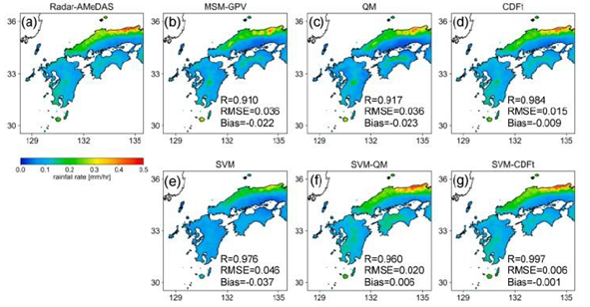

[Previous](initiatives-and-programs.md) | [Table of contents](README.md) | [Next](use-cases-at-WGISS.md)

***
# 5. Usage methods of machine learning and AI for Earth observation
There are a wide range of standard machine learning approaches which are commonly applied to domains such as Computer Vision. In this section we will outline the common machine learning approaches taken, and provide examples of how these approaches can be applied to Earth Observation data. This will provide an overview of the machine learning terminology, suitable applications of a given approach to EO, but is not complete nor exclusive. 

## 1) Classification
In machine learning, classification is the process of categorizing or classifying input data into predefined discrete classes or categories. The goal of classification is to develop models or algorithms that can learn from historical data and make predictions about the class labels of new, unseen data points. The classification output is a predicted label, and sometimes a confidence or percentage allocation to each of the given classes. A typical example of classification in Earth Observation is land cover mapping, where each individual pixel is treated independently and provided with a classification for a given land cover type.. For evaluation purposes, classification can typically be evaluated using a confusion matrix [Confusion Matrix Example] or with an overall class accuracy, though the accuracy depends highly on having an even distribution of each class label. [SECTION ON UNBALANCED DATASETS?]

## 2) Object Detection
In Computer Vision, object detection is the process of finding individual objects within an image. This is typically performed by the identification of a bounding box around the identified object. These objects could be man-made objects, such as boats  or naturally occurring events, such as typhoons. To evaluate the success of the object detection approach, it is common to use the Intersection Over Union (IOU), which evaluates how well the identified labels overlap with the ground truth. The intersection is the area both the predicted label and the ground truth overlap with each other, and the union is the area that both ground truth and predicted labels occupy in total. then the IOU can be calculated as 
IOU = IntersectionUnion
This produces a ratio of how well the prediction and label overlap.

## 3) Semantic Segmentation
Semantic Segmentation is the process of identifying individual classes on a per-pixel basis. This approach will focus on labelling each individual pixel into a given class but will not separate out or discriminate between different objects of the same class. Semantic Segmentation can be considered an extension of classification to spatio-temporal data, and follows similar evaluation methods to classification approaches.

## 4) Instance Segmentation
Instance segmentation can be considered the combination of Object Detection and Semantic Segmentation. In this computer vision domain, objects are identified, and each individual object has each pixel labeled as a given class. This means that if two objects are next to each other, or overlapping, then they are independently identified and each pixel location of each can be allocated to one of the two objects. For example if we are detecting building, and there were two building next to each other with a small overlap due to viewing angle, Semantic Segmentation would classify them both as one class, where as instance segmentation would discriminate between individual instances, but both falling into the same class of building. 

## 5) Time Series/Prediction/
Classifying and identifying unknown data   input based on pre-trained data. 

focus has been around modeling and assimilation. Some other research around big data mining, predictions and forecasts have also been supported by them over the years. 

## 6) Image translation/fusion
Compositing and outputting data that input based on pre-trained data.

## 7) Regression
A regression task is one where instead of values being predicted to a discrete class, the output prediction is some form of continuous variable. This could be to predict a biomass for a particular location or the Sea Surface Temperature. This is a very common approach when producing a new EO product, to approximate values on a scale. Typical evaluation metrics for regression tasks include RMSE (Root Mean Square Error) and or MAE(Mean Absolute Error), which are metrics for measuring the combined error for the prediction. 

## 8) Surrogate model or Model Emulator
A surrogate model, or model emulator is an approach which represents a large scale numerical model, and approximates all or a component of the state of the model from a set of given inputs. This is particularly useful for interpreting smaller components of models or making short time predictions on individual variables, which has the ability of hypoxic events in marine biogeochemical models, without the requirement to run the entire model for a particular time range. The real advantage of these models is that they can produce considerably less computationally expensive equivalents to models, which can be run multiple times to explore a set of given scenarios quickly and efficiently, so could be advantageous for Near Real Time (NRT) prediction and forecasting.  

***
[Previous](initiatives-and-programs.md) | [Table of contents](README.md) | [Next](use-cases-at-WGISS.md)
